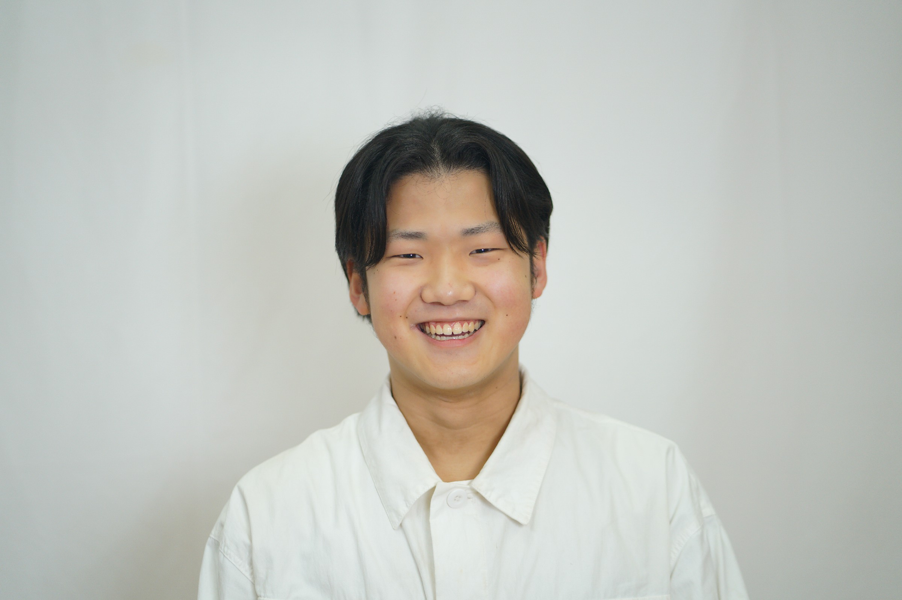
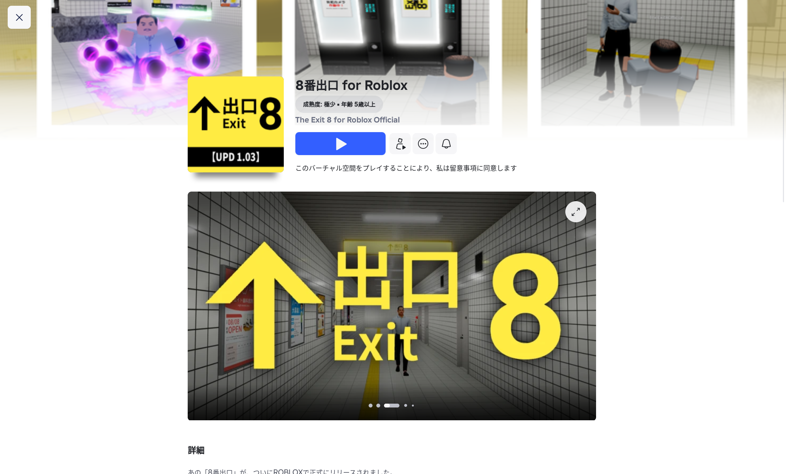
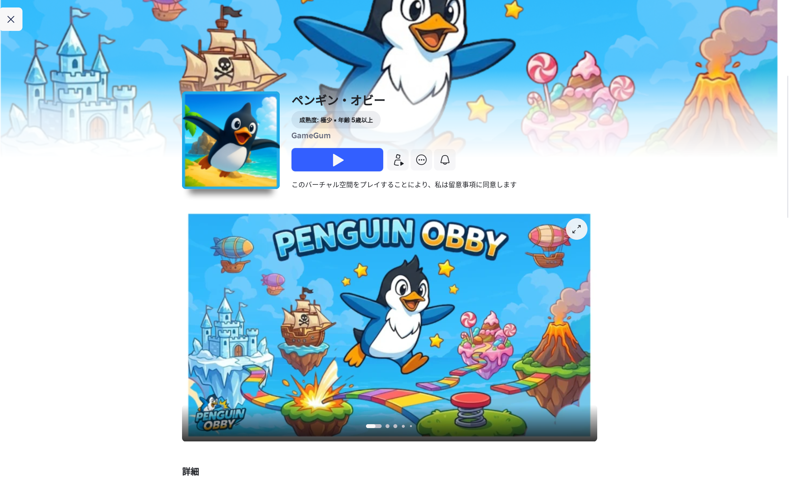
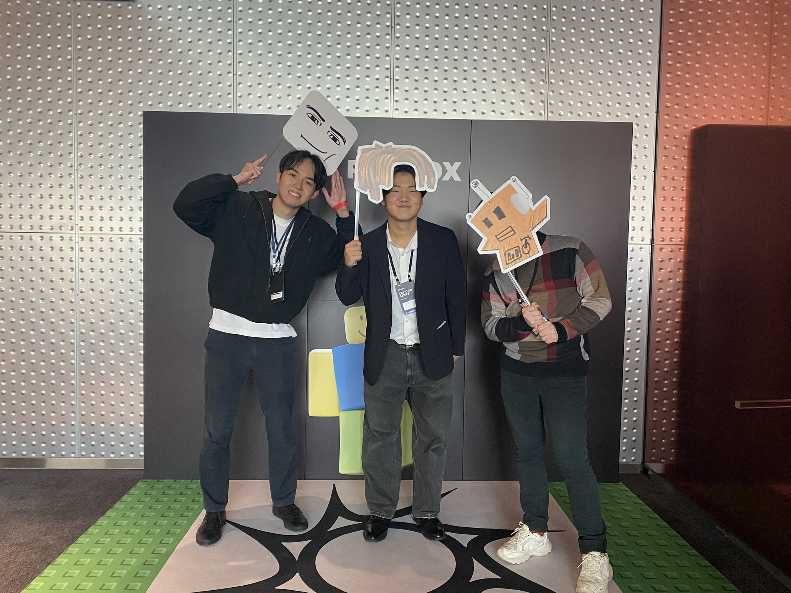

# プロフィール

## 名前（なまえ）
安藤 太亮（あんどう たいすけ）

## 仕事（しごと）
**株式会社ゲームガム 副社長**
会社をうごかすしごとと、ゲームづくりをしています。

## これまでのこと
小学校のころから、鳥取県のプログラミング大会に出てきました。  
これまでに **3回 ゆうしょう** したことがあります。

## 今やっていること
今は大学生です。  
大学ではプログラミングのべんきょうをしながら、会社のしごとや、ゲームづくりをしています。

## ゲームづくりについて
ゲームガムでは、いろいろなゲームを作っています。

- **「8番出口」こうしきコンテンツ** のゲームづくりにさんか

- **「ペンギンホビー」** というゲームをじぶんたちで作っています  

  → あそんでくれた人は **45万人** をこえました

## Robloxのイベントについて
11月に東京で、**Roblox クリエイター シリーズ（RCS）** というイベントがありました。

このイベントには、**Roblox Japan こうしき** からしょうたいをいただき、さんかさせていただきました。

イベントでは、
- いろいろなゲームを作っている人
- にげるゲームを作った人
- インフルエンサーの人たち  

と たくさんお話しをしました。

また、スペシャルゲストとして  
**ヒカキンさん** や **マエスケ** も とうじょうするイベントでした。

## 今のとりくみ
今は、Robloxのなかのコミュニティで  みんなと きょうりょくしながら、会社の中でゲームづくりを進めています。

## さいごに
みなさんと いっしょに  **あたらしいゲームを作れることを たのしみにしています！**