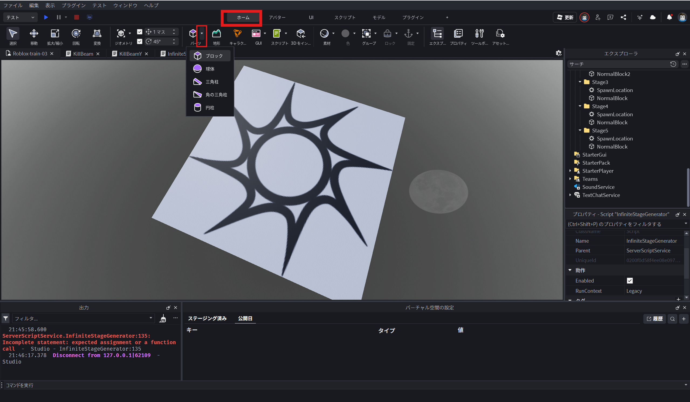
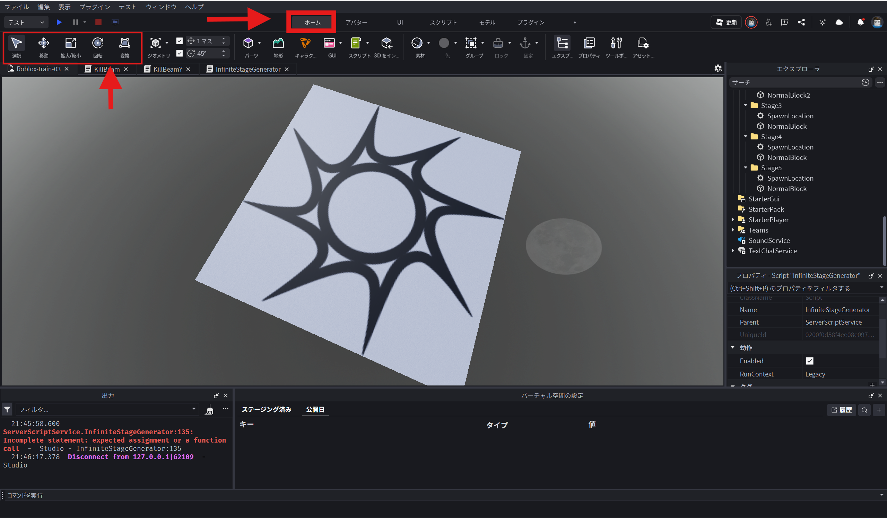
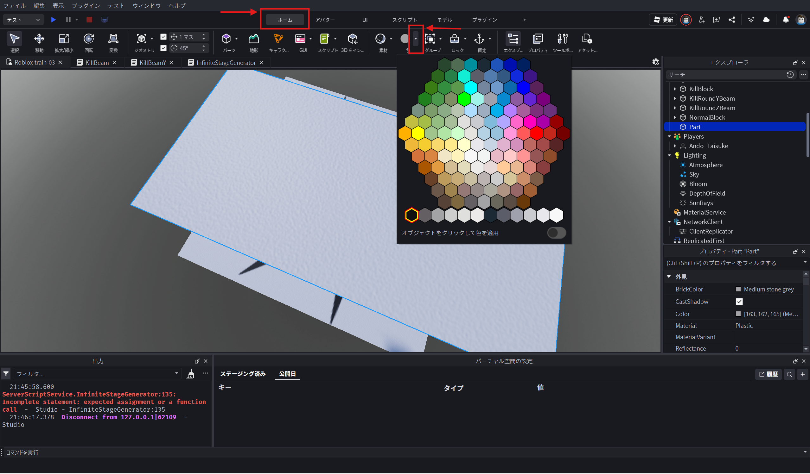
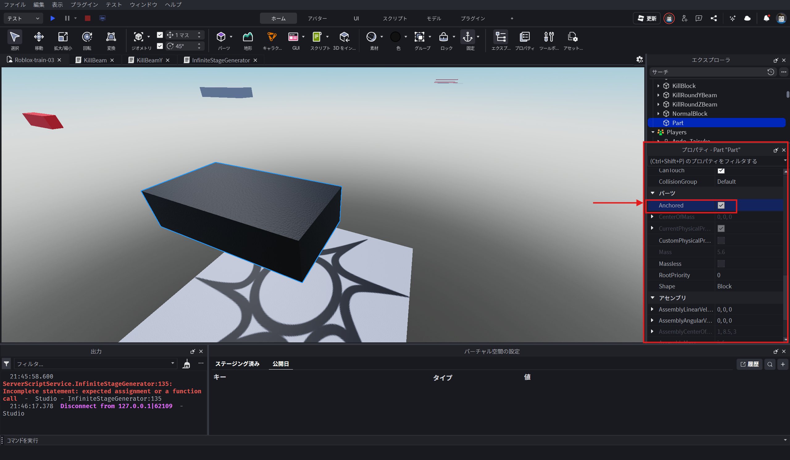
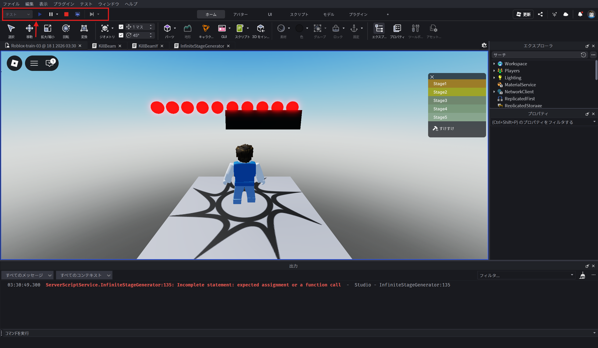

# ロブロックス・スタジオ（Roblox Studio）の つかいかた 🎮

ロブロックス・スタジオは、きみだけのゲームを作る「こうじょう」だよ。
レゴブロックを組み立てるみたいに、好きな世界を作ってみよう！

## 1. 画面の動かし方（カメラ）👀
まずは、ゲームの世界をいろんな角度（かくど）から見てみよう。

* **右クリックを押したままマウスを動かす**
    * → 首を振るみたいに、あたりを見わたせるよ。
* **「W・A・S・D」キー（または矢印キー）**
    * → カメラ自体が動くよ。
    * **W**: 前に進む
    * **S**: 後ろに下がる
    * **A**: 左に動く
    * **D**: 右に動く
* **マウスの真ん中のコロコロ**
    * → ズームイン（近くへ）、ズームアウト（遠くへ）。

## 2. ブロックを出してみよう 📦
地面や壁（かべ）を作るためのブロックを出してみよう。

1.  画面の上にある「ホーム」という場所をクリック。
2.  「パーツ (Part)」というボタンを探してクリック。
    * 四角いブロックが画面の真ん中に出てくるよ！
    * 「パーツ」の下の小さい矢印を押すと、丸い玉や、三角のブロックも選べるよ。

## 3. ブロックを動かしたり、大きくしたりしよう 🛠️
出したブロックを好きな形にしよう。画面の上にある4つのボタンを使うよ。

### ① 選択（セレクト）
* 矢印（やじるし）のマーク。
* これを押してからブロックをクリックすると、そのブロックを選べるよ。

### ② 移動（いどう）
* 十字（じゅうじ）の矢印マーク。
* これを選ぶと、ブロックに**「矢印」**が出てくるよ。
* 矢印を引っ張ると、その方向にブロックが動くよ。

### ③ スケール（大きさ）
* 四角いマーク。
* これを選ぶと、ブロックに**「丸い点」**が出てくるよ。
* 点を引っ張ると、ブロックが**ビヨーン**と伸びて大きくなるよ。

### ④ 回転（かいてん）
* グルッとした矢印マーク。
* これを選ぶと、ブロックに**「輪っか」**が出てくるよ。
* 輪っかを動かすと、ブロックがクルッと回るよ。

## 4. 色を変えてみよう 🎨
ブロックの色を変えて、かっこよくしよう。

1.  色を変えたいブロックをクリックして選ぶ。
2.  画面の上にある「カラー (Color)」をクリック。
3.  好きな色を選ぼう！

※ その隣にある「素材 (Material)」を変えると、木やレンガ、ネオン（光るブロック）に変えられるよ。

## 5. 大事な設定「アンカー」⚓
これを知らないと、ブロックが落ちちゃうよ！

* 空中にブロックを置きたいときは、そのブロックを選んで、画面の上のほうにある「アンカー (Anchor)」というボタンを押そう。
* これを押すと、ブロックが空中で「固定（こてい）」されて、落ちなくなるよ。
* （画鋲（がびょう）やノリで貼り付けるイメージだよ！）

## 6. ゲームを遊んでみよう（テスト）▶️
作っているゲームを自分で遊んでみよう。

1.  画面の上にある青い**「プレイ (Play)」**ボタンを押す。
2.  自分のアバターが出てきて、実際に歩いたりジャンプしたりできるよ！
3.  終わるときは、画面の上にある**「停止 (Stop)」**ボタンを押してね。

### ⭐ おぼえておこう！
* **まちがえたとき**: キーボードの**「Ctrl」**を押しながら**「Z」**を押すと、ひとつ前に戻せるよ。
* **消したいとき**: ブロックを選んで、キーボードの**「Delete」**か**「Backspace」**を押すと消えるよ。

さあ、きみだけのすごいゲームを作ってみよう！🚀